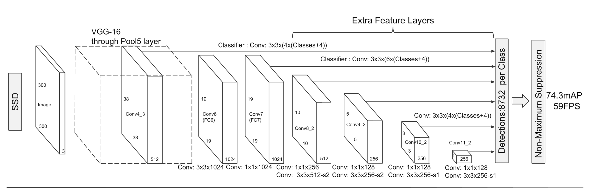

## SSD
#### 项目代码参考pytorch官方源码
- https://github.com/pytorch/vision/tree/master/torchvision/models/detection

#### 环境配置
```
torch==1.8.1
torchvision==0.9.1
Pillow==8.1.2
numpy==1.19.2
matplotlib==3.3.4
lxml==4.6.3
json
```

#### 项目结构
```
|--dataset_preprocess: 自定义DataSet，读取PASCAL VOC数据集
|--backbone：ssd_vgg16特征提取网络
|--_utils
|     |--boxes：Default box操作相关
|     |--box_code：将边界框解码/编码成用于训练回归器的表示
|     |--defaultbox: 生成Default boxes
|     |--ssd_match：给每个default box匹配对应的GT box
|     |--ssd_transform: 标准化和resize操作
|--ssd: SSD网络结构
|--train_ssd300_vgg16：ssd300_vgg16训练脚本
```

#### 数据集：PASCAL VOC2012数据集
- 下载地址：http://host.robots.ox.ac.uk/pascal/VOC/voc2012/VOCtrainval_11-May-2012.tar

#### 权重信息
- 下载地址：https://download.pytorch.org/models/ssd300_vgg16_coco-b556d3b4.pth

#### 训练方法：
1. 下载`PASCAL VOC2012`数据集，并将其放在项目根目录下
2. 下载`backbone ssd300_vgg16`权重，路径与`train_ssd300_vgg16.py`中载入模型参数位置保持一致
3. 运行`train_ssd300_vgg16.py`文件

#### 网络结构图
